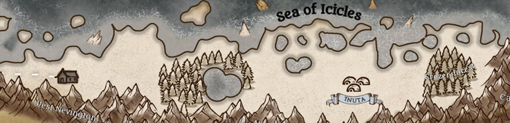

---
title: "Inuta"
sidebar_position: 13
---

 

Located on the other side of the Nevington Mountains, Inuta is the
northernmost settlement in all of Norberia. Due to the low temperatures,
constant snowfall and strong wind, only the strongest can survive here.

 

Its inhabitants are simple people who dedicate themselves above all to
hunting whales and seals to feed themselves to pass the eternal winters
that plague the region. They are mainly nomads travelling where food and
warmth can be located.

 
