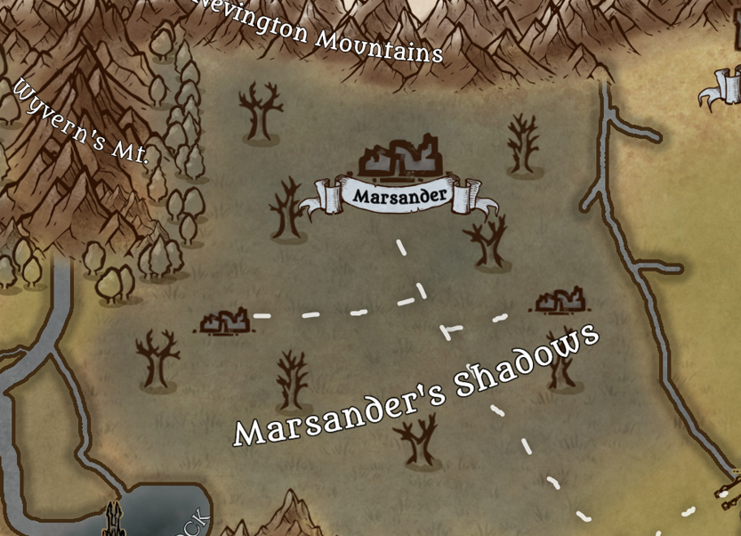

---
title: "Marsander Shadows"
sidebar_position: 3
---

Located in the northeast of the continent, the shadows of Marsander is
the name given to the lands of the ancient kingdom of Marsander.

Today they are nothing more than swamps and plains completely devastated
by corruption and ruins of what once was a big empire.

Numerous creatures of unspeakable name and highly dangerous live there.

It was here where the allied nations, aided by the Silvertusk company,
fought against the Marsandines and managed to repel their forces.

After some kind of unknown disaster, the entire region was engulfed by
shadows and reduced to ruins and misery.

No one has dared enough to walk through the ancient ruins of the capital
again and come back to tell the tale.

Thanks to the Silvertusk Brotherhood, the monsters and dangers are kept
away within the borders of the old Marsander territory.
