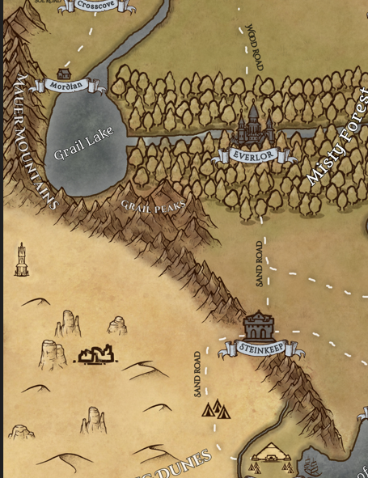

---
title: "Mauer Mountains"
sidebar_position: 1
---

Together with the Nevington Mountains they are the other major mountain
system of Norberia.

It also gets the nickname of the sand wall, because its mountains stop
the great winds loaded with sand from the ever-changing dunes.
