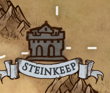

---
title: "Steinkeep"
sidebar_position: 3
---

More than a city, it is a great fortress located in the middle of the
Mauer Mountains and serving as a border between Norberia and the rest of
the world to the west. It is also the main border crossing for caravan
trade coming from Neu Samir towards Gardis and Everlor.
