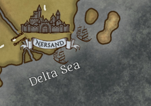

Located in the northeast of
[Norberia](/docs/regions/norberia/)
in the Delta Sea, Nersand is the capital of the continent. It is
governed by a council of 7 masked wise individuals each taking care of a
different aspect of rulership. It is the largest city on the entire
continent and has one of the most impressive fleets of ships known, only
rivaled by Gardis.

Due to the recent discovery of the
[Lútaca](/docs/regions/l-taca/)
continent, it has seen a new era thanks to the new riches brought from
Lútaca. It has control over the entire continental northeast, over Fin
Island and the first city of
[Lútaca](/docs/regions/l-taca/),
[Puerto
Arena](/docs/regions/l-taca/puerto-arena).
But their influence extends as far as Longsaddle, having consuls at
almost every city of Norberia.

It has a highly transited maritime trade route with
[Gardis](/docs/regions/gardis/),
unfortunately it passest through [Puerto
Ballena,](/docs/regions/puerto-ballena)
which causes it to be in a constant conflict with the pirates living
there.

It is also responsible for keeping the [Prime
Road](/docs/regions/norberia/prime-road)
secure for their travellers and there are several tolls along the way./

The city is the house of several important factions of Norberia like the
honorable order of paladins and clerics of the Radiant Lion, the Emerald
Watchers rangers and scouts, and there are rumors that there is a
criminal organization called the Shadows Void.

They are also renown for the centenary big tournament organized by a
mysterious entity named the Amirah and it was said that the winner could
get whatever their hearts desired.

Once every 100 years a tournament of valor is held here by a mistery
figure named the Amirah. It is believed that the winner see their
biggest wish come true.

