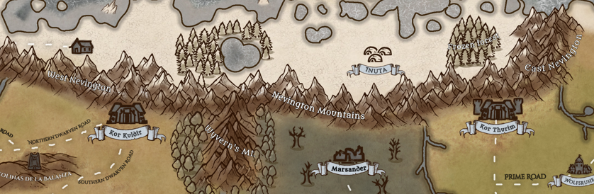

---
title: "Nevington mountains"
sidebar_position: 1
---

 

 

Together with the Mauer
Mountains
they are the largest mountain system in
Norberia.
It is divided into three zones, the western Nevington, the central
system and the eastern Nevington.

 

It works as a natural wall for the icy winds that come from the sea of
icicles which threatens to freeze the whole continent with their
incesant blow.

 

Two dwarven fortresses find their home in these mountains. Kor
Kuldir
on the west system and Kor
Thurim
to the east. From its central area comes a mountain range known as the
Wyvern's Mountains.

