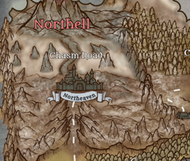

---
title: "Northell"
sidebar_position: 2
---

Volcano located north of
Northeaven.
It was once believed to be just a mountain formation, but one day it
erupted and has been belching magma and ash ever since, covering all
nearby areas with a dense layer of ash and smoke that prevents sunlight
from passing through.

