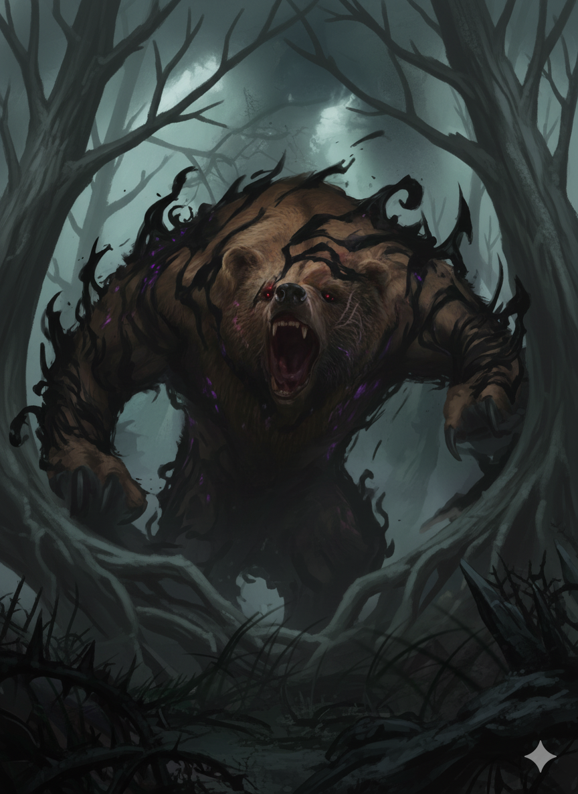

---
title: "Urs"
sidebar_position: 1
---

Legendary human Smith from the Material Plane and very good friend of
Ralto. He used to travel the planes in search of high Yal levels of ore.
He contracted the curse of Ursanthropy from a planar entity and got lost
in the planes after a failed teleport spell.

It is believe that he was stranded in the Shadowfell for hundreds of
years.

Ralto told the party that Urs was the one who gifted the golems of his
bazar to him.
